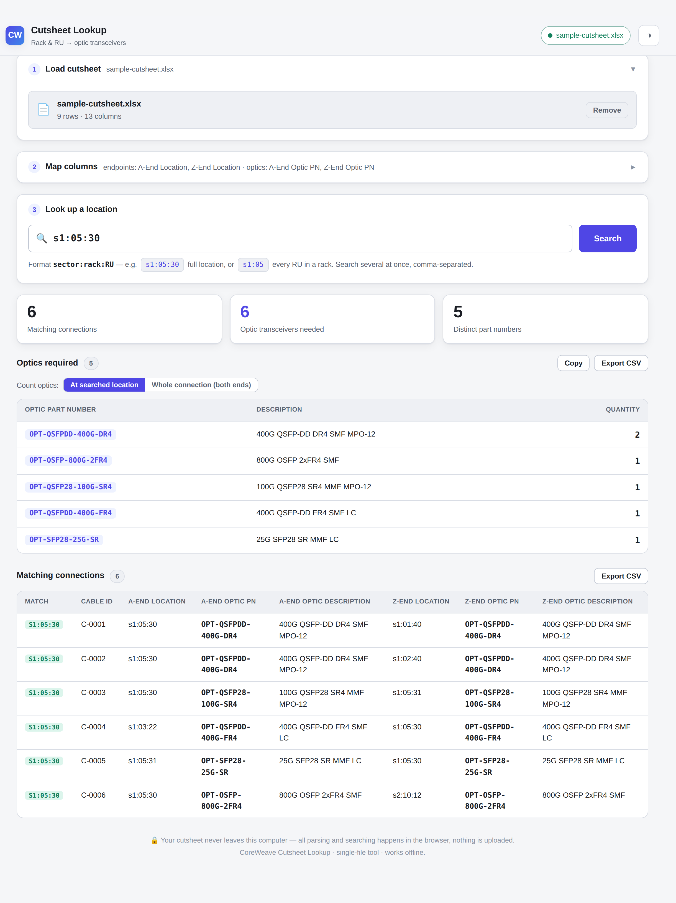

# CoreWeave Cutsheet Lookup

A lightweight GUI tool for the networking team. Load a CoreWeave cutsheet,
type a rack/RU location (e.g. `s1:05:30`), and instantly get **every
connection that references it** plus a rolled-up list of the **optic
transceivers needed, by part number and quantity**.

Everything runs **locally in the browser** — the cutsheet is never uploaded
anywhere. The whole tool ships as a **single HTML file** you can email, drop
on a shared drive, or open straight from disk. It works offline.



---

## For the team — how to use it

1. Get the file **`dist/coreweave-cutsheet-lookup.html`** (double-click to open
   in Chrome/Edge/Firefox/Safari — no install, no internet needed).
2. **Load cutsheet** — drag your `.xlsx` / `.xls` / `.csv` onto the box, or click
   to browse. Multi-tab workbooks let you pick the worksheet.
3. **Map columns** *(step 2)* — the tool auto-detects your columns. Expand the
   panel only if something looks wrong, and point it at:
   - the **endpoint** column(s) that hold locations, and
   - the **optic PN** column(s).
4. **Look up a location** *(step 3)* — type e.g. `s1:05:30` and hit **Search**.

### Location format

`sector : rack : RU` — for example `s1:05:30` means **sector 1, rack 05, RU 30**.

- The match is tolerant: `s1:05:30`, `S1-05-30`, `S1 R05 RU30`, and `s1:5:30`
  are all treated the same (leading zeros don't matter).
- **Partial lookups** work: `s1:05` returns **every RU in rack 05 of sector 1**.
- Search **several at once** by separating with commas: `s1:05:30, s1:06:12`.

### Reading the results

- **Matching connections** — every cutsheet row that touches the location, with
  a green badge showing which end matched. This is the source of truth.
- **Optics required** — the transceivers totalled by part number. Toggle:
  - **At searched location** — only the optic that terminates at the RU you
    searched (what you'd physically install there).
  - **Whole connection (both ends)** — every optic on the matched cables.
- **Copy** / **Export CSV** hand the results off to a BOM, ticket, or email.

---

## Repo layout

| Path | What it is |
| --- | --- |
| `dist/coreweave-cutsheet-lookup.html` | **The deliverable** — single self-contained file to share. |
| `index.html`, `styles.css`, `app.js` | Editable source (what you change). |
| `vendor/xlsx.full.min.js` | [SheetJS](https://sheetjs.com) — reads Excel/CSV in-browser. |
| `build.mjs` | Inlines the source into the single `dist/` file. |
| `sample/sample-cutsheet.xlsx` / `.csv` | Dummy cutsheet for demos/testing (invented data). |
| `scripts/make-sample.mjs` | Regenerates the sample cutsheet. |
| `scripts/test.mjs` | Headless tests for the matching/aggregation logic. |
| `scripts/screenshot.mjs` | Drives the app in Chromium to screenshot it. |

## Developing

```bash
npm run sample   # regenerate the demo cutsheet
npm run test     # run the logic tests (no browser needed)
npm run build    # rebuild dist/coreweave-cutsheet-lookup.html
```

Edit `app.js` / `styles.css` / `index.html`, then `npm run build` to refresh the
single-file distributable. Optional: `npm i` then `npm run screenshot` to render
preview images (uses Playwright + the bundled Chromium).

## How matching works (brief)

Each queried location is parsed into `(sector, rack, RU)`. Every mapped endpoint
cell on every row is parsed the same way and compared component-by-component;
only the components you supply have to match, which is what makes partial
lookups like `s1:05` work. Optics are then aggregated across the matched rows —
optionally filtered to just the end that matched — summing an explicit quantity
column if you mapped one, otherwise counting one per connection.

## Notes / roadmap

- Auto-detection is tuned for common cutsheet headers (A-End/Z-End, Sector/Rack/RU,
  "Optic PN", "Part Number", "Description", "Qty"). If your real cutsheet uses
  different names, the **Map columns** panel handles it — and the auto-detect
  keywords in `app.js` (`autoDetectMapping`) can be extended to make it turnkey.
- Split location columns (separate Sector / Rack / RU) are supported per endpoint
  via the "Sector/Rack/RU" toggle in step 2.
